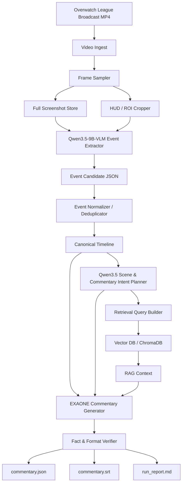
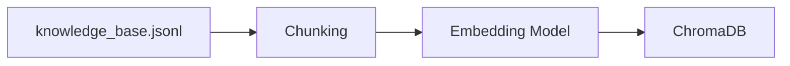
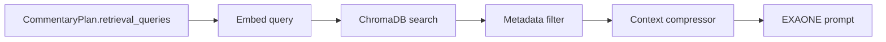
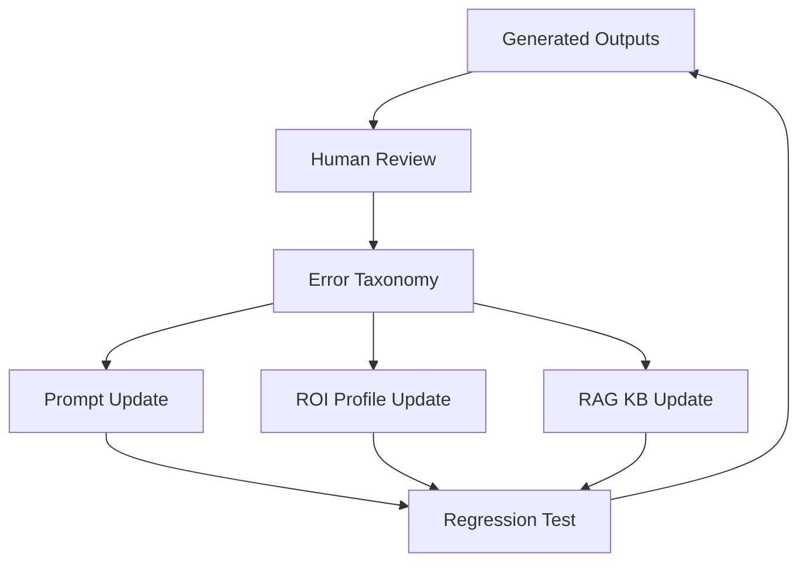

# ARCHITECTURE: Vision-to-Caster MVP

**문서 버전:** v0.2  
**작성일:** 2026-05-30  
**시스템명:** Vision-to-Caster  
**목표:** 오버워치 리그 중계 영상에서 스크린샷 기반 이벤트 JSON을 추출하고, Agentic RAG와 EXAONE을 통해 한국어 해설 텍스트를 생성한다.

---

## 1. 아키텍처 요약

본 시스템은 두 개의 로컬 LLM 역할을 분리한다.

```text
Qwen3.5-9B-VLM Q4_K_M
- 입력: 오버워치 리그 중계 스크린샷
- 출력: HUD 이벤트 JSON, 장면 요약, 해설 의도, 검색 query
- 역할: Vision Event Extractor + Scene Understanding Agent

EXAONE 3.5 7.8B Instruct Q4_K_M
- 입력: 정규화된 이벤트 JSON, 해설 의도, RAG 문맥
- 출력: 자연스러운 한국어 오버워치 리그 해설 텍스트
- 역할: Korean Commentary Generator
```

핵심 원칙은 다음과 같다.

1. VLM은 **영상 속 사실 후보를 구조화**한다.
2. Agent는 **장면의 해설 방향과 필요한 검색 문맥**을 결정한다.
3. RAG는 **전술/영웅/맵/해설 스타일 지식**을 보강한다.
4. EXAONE은 **검증된 사실만 사용해 한국어 해설을 생성**한다.
5. 후처리기는 **사실성, JSON 형식, SRT 형식**을 검증한다.

---

## 2. 전체 데이터 플로우



---

## 3. 런타임 구성

### 3.1 Target Runtime

| 컴포넌트 | 런타임 | 모델/라이브러리 | 설명 |
|---|---|---|---|
| VLM inference | Ollama target | `hf.co/jc-builds/Qwen3.5-9B-VLM-Q4_K_M-GGUF:Q4_K_M` | 스크린샷 기반 이벤트 추출 |
| Korean LLM inference | Ollama | `hf.co/LGAI-EXAONE/EXAONE-3.5-7.8B-Instruct-GGUF:Q4_K_M` | 한국어 해설 생성 |
| Embedding | Ollama 또는 local embedding | `nomic-embed-text` / `bge-m3` | RAG indexing/search |
| Vector DB | Local Python | ChromaDB | 영웅/맵/전술/스타일 검색 |
| Orchestration | Python | LangGraph 또는 custom DAG | 파이프라인 실행 |
| Video processing | Python | OpenCV / ffmpeg | 프레임 추출, ROI crop |
| Validation | Python | Pydantic / jsonschema | JSON schema 검증 |

### 3.2 실행 명령

#### Qwen3.5-VLM

```bash
ollama run hf.co/jc-builds/Qwen3.5-9B-VLM-Q4_K_M-GGUF:Q4_K_M
```

#### EXAONE

```bash
ollama run hf.co/LGAI-EXAONE/EXAONE-3.5-7.8B-Instruct-GGUF:Q4_K_M
```

#### Embedding 예시

```bash
ollama pull nomic-embed-text
```

---

## 4. 중요한 호환성 판단

`jc-builds/Qwen3.5-9B-VLM-Q4_K_M-GGUF`는 이미지-텍스트 모델로 표시되며, `Qwen3.5-9B-Q4_K_M.gguf`와 `mmproj-F16.gguf`를 포함한다. 모델 카드에는 Ollama 실행 명령도 제공된다.

그러나 동일 모델 카드의 compatibility 표에는 다음 취지의 제한이 표시되어 있다.

```text
Backend      Text    Vision    Notes
llama.cpp    Yes     Yes       Full support with --mmproj flag
Ollama       Yes     No        Does not support separate mmproj files yet
```

따라서 이 아키텍처는 **Ollama-first 설계**이지만, Phase 0에서 반드시 다음을 확인해야 한다.

1. Ollama가 해당 HF GGUF repo의 이미지 입력을 실제로 처리하는가?
2. `mmproj-F16.gguf`가 Ollama 실행 시 자동 연결되는가?
3. 스크린샷을 입력했을 때 모델이 화면 내용을 근거로 JSON을 생성하는가?

통과하지 못하면 VLM runtime만 `llama.cpp server`로 대체하고, EXAONE은 Ollama에 유지하는 fallback architecture를 사용한다.

---

## 5. 폴더 구조

```text
vision-to-caster/
├─ app/
│  ├─ main.py
│  ├─ config/
│  │  ├─ pipeline.yaml
│  │  ├─ roi_profiles/
│  │  │  └─ owl_broadcast_default.yaml
│  │  └─ prompts/
│  │     ├─ qwen_vlm_event_extraction.md
│  │     ├─ qwen_scene_planner.md
│  │     └─ exaone_commentary_generator.md
│  ├─ video/
│  │  ├─ ingest.py
│  │  ├─ frame_sampler.py
│  │  └─ roi_cropper.py
│  ├─ vlm/
│  │  ├─ qwen_client.py
│  │  ├─ event_extractor.py
│  │  └─ scene_planner.py
│  ├─ timeline/
│  │  ├─ normalizer.py
│  │  ├─ deduplicator.py
│  │  └─ schemas.py
│  ├─ rag/
│  │  ├─ build_index.py
│  │  ├─ retriever.py
│  │  ├─ knowledge_base.jsonl
│  │  └─ chroma_db/
│  ├─ generation/
│  │  ├─ exaone_client.py
│  │  ├─ commentary_generator.py
│  │  └─ verifier.py
│  └─ output/
│     ├─ srt_writer.py
│     └─ report_writer.py
├─ input/
│  └─ videos/
├─ data/
│  ├─ frames/
│  ├─ crops/
│  ├─ event_candidates/
│  └─ timelines/
├─ output/
│  ├─ commentary.json
│  ├─ commentary.srt
│  └─ run_report.md
├─ requirements.txt
├─ PRD.md
└─ ARCHITECTURE.md
```

---

## 6. 컴포넌트 상세

### 6.1 Video Ingest

입력 영상의 metadata를 읽고 pipeline job을 생성한다.

**입력:**

```json
{
  "video_path": "input/videos/owl_match_001.mp4",
  "video_id": "owl_match_001",
  "map": "King's Row",
  "teams": ["TeamA", "TeamB"]
}
```

**출력:**

```json
{
  "video_id": "owl_match_001",
  "fps": 59.94,
  "duration_sec": 1842.5,
  "width": 1920,
  "height": 1080,
  "frame_count": 110439
}
```

---

### 6.2 Frame Sampler

영상에서 스크린샷을 추출한다.

**정책:**

- 기본 1 FPS
- 장면 변화가 큰 구간은 추가 샘플링
- 나중에 OCR/killfeed 변화 감지 기반 adaptive sampling을 추가할 수 있음

**파일명 규칙:**

```text
data/frames/{video_id}/{time_sec:09.2f}.jpg
```

예:

```text
data/frames/owl_match_001/000123.40.jpg
```

---

### 6.3 ROI Cropper

방송 화면의 HUD 영역을 잘라낸다.

**ROI config 예:**

```yaml
profile_name: owl_broadcast_default
resolution: [1920, 1080]
regions:
  top_bar:
    x: 360
    y: 0
    w: 1200
    h: 130
  killfeed_right:
    x: 1380
    y: 120
    w: 520
    h: 260
  lower_hud:
    x: 300
    y: 780
    w: 1320
    h: 300
  center_scene:
    x: 240
    y: 160
    w: 1440
    h: 720
```

**주의:** 오버워치 리그 방송 레이아웃은 시즌, 리그, 관전 UI, 리플레이 화면 여부에 따라 달라질 수 있으므로 ROI profile은 영상별로 교체 가능해야 한다.

---

### 6.4 Qwen3.5-VLM Event Extractor

스크린샷과 ROI 이미지를 입력받아 이벤트 후보 JSON을 생성한다.

#### 역할

- HUD 존재 여부 판단
- 킬로그 후보 추출
- 궁극기 사용 후보 추출
- 교전 발생 여부 판단
- 오브젝트 진행/점수판 후보 추출
- 화면 장면 요약
- evidence area와 confidence 부여

#### Prompt contract

`app/config/prompts/qwen_vlm_event_extraction.md`

```text
You are a vision event extraction model for Overwatch League broadcast screenshots.

Analyze the provided screenshot and optional HUD crops.
Return JSON only. Do not use markdown.

Rules:
- Use only visible evidence from the screenshot.
- Do not invent player names, hero names, kills, ultimates, team names, or objective states.
- If text is partially visible, set the field to null and explain uncertainty.
- Every event must include confidence and evidence_area.
- If you cannot read the HUD, say so in warnings.

Output schema:
{
  "frame_id": "string",
  "time_sec": 0.0,
  "camera_view": "broadcast_spectator|first_person|third_person|replay|unknown",
  "visible_hud": {
    "killfeed_present": true,
    "scoreboard_present": true,
    "objective_ui_present": true,
    "broadcast_overlay_present": true
  },
  "events": [
    {
      "event_type": "kill|death|ultimate_used|objective_progress|teamfight_start|teamfight_win|unknown",
      "time_sec": 0.0,
      "actor": null,
      "actor_team": "blue|red|unknown|null",
      "actor_hero": null,
      "target": null,
      "target_team": "blue|red|unknown|null",
      "target_hero": null,
      "ability": null,
      "evidence_area": "full_frame|top_bar|killfeed_right|lower_hud|center_scene|broadcast_caption",
      "confidence": 0.0,
      "uncertainty_reason": null
    }
  ],
  "scene_summary": "string",
  "commentary_intent": {
    "segment_type": "neutral_setup|teamfight_start|first_pick|ultimate_commitment|clutch_play|teamfight_win|objective_progress|reset_or_regroup|uncertain",
    "recommended_tone": "energetic_play_by_play|calm_analysis|dramatic_highlight|cautious_observation",
    "key_points": []
  },
  "warnings": []
}
```

#### Temperature

```text
temperature = 0.0
top_p = 0.9
```

이벤트 추출은 창의성이 아니라 정확성이 목표이므로 temperature 0을 기본값으로 한다.

---

### 6.5 Event Normalizer / Deduplicator

VLM event 후보를 canonical timeline으로 정규화한다.

#### Dedup key

```text
event_type + actor + target + actor_hero + target_hero + time_window
```

#### Dedup window

```text
kill: 3 sec
ultimate_used: 5 sec
objective_progress: 10 sec
teamfight_start: 8 sec
```

#### 충돌 처리

- 같은 시간대에 서로 다른 actor/target이 감지되면 둘 다 보존한다.
- confidence 차이가 0.2 이상이면 높은 쪽을 canonical로 선택한다.
- confidence 차이가 작으면 `needs_human_review=true`로 표시한다.

---

### 6.6 Scene & Commentary Intent Planner

정규화된 segment timeline을 받아 해설 방향을 결정한다. 이 기능은 Qwen3.5-VLM을 그대로 사용하되, 입력은 이미지가 아니라 텍스트 JSON이다.

#### 입력

```json
{
  "segment_id": "owl_match_001_0120_0130",
  "canonical_events": [],
  "scene_summaries": [],
  "previous_segment_summary": "...",
  "map": "King's Row",
  "teams": ["TeamA", "TeamB"]
}
```

#### 출력

```json
{
  "commentary_intent": "first_pick",
  "tone": "energetic_play_by_play",
  "priority_facts": [],
  "retrieval_queries": [],
  "do_not_say": [],
  "confidence": 0.0
}
```

#### 판단 기준

- 킬이 처음 발생했는가?
- 지원가가 먼저 잘렸는가?
- 궁극기 투자 대비 킬 성과가 있었는가?
- 오브젝트 진행에 직접적인 영향이 있는가?
- 정보가 부족해 단정하면 안 되는가?

---

### 6.7 RAG Retriever

Agent가 만든 query를 기반으로 ChromaDB에서 관련 문서를 검색한다.

#### Knowledge base schema

```jsonl
{"id":"hero_ana_001","text":"아나가 먼저 잘리면 생체 수류탄, 수면총, 나노 강화제 변수와 유지력이 동시에 사라진다.","metadata":{"collection":"hero_abilities","hero":"Ana","lang":"ko"}}
{"id":"style_first_pick_001","text":"첫 킬이 발생한 상황에서는 '첫 킬이 올라갑니다', '숫자 우위를 잡습니다', '한타의 문을 먼저 엽니다' 같은 표현을 사용할 수 있다.","metadata":{"collection":"caster_style_ko","event":"first_pick","lang":"ko"}}
{"id":"tactic_ult_commit_001","text":"궁극기 투자 상황에서는 투자한 궁극기 수와 실제 킬 성과를 비교해 해설한다.","metadata":{"collection":"tactical_patterns","pattern":"ultimate_commitment","lang":"ko"}}
```

#### Retrieval policy

- query당 top_k = 3
- segment당 최대 8개 문서
- 중복 문서 제거
- metadata filter 우선순위: hero → event_type → map → style

---

### 6.8 EXAONE Commentary Generator

EXAONE은 canonical timeline, commentary intent, RAG context를 받아 한국어 해설을 생성한다.

#### Prompt contract

`app/config/prompts/exaone_commentary_generator.md`

```text
당신은 한국어 오버워치 리그 전문 캐스터입니다.

아래 EVENT_TIMELINE, COMMENTARY_INTENT, RAG_CONTEXT만 근거로 해설을 생성하세요.

절대 규칙:
- EVENT_TIMELINE에 없는 킬, 궁극기, 선수명, 영웅명, 팀명, 오브젝트 상태를 만들지 마세요.
- confidence가 낮은 이벤트는 단정하지 말고 신중하게 표현하세요.
- RAG_CONTEXT는 용어, 전술 의미, 문체 참고용입니다. 새로운 경기 사실로 취급하지 마세요.
- 한국 e스포츠 중계처럼 자연스럽고 생동감 있게 작성하세요.
- play_by_play는 짧고 현장감 있게 작성하세요.
- color_commentary는 왜 중요한 장면인지 설명하세요.

출력은 JSON만 반환하세요.

{
  "segment_id": "string",
  "start_sec": 0.0,
  "end_sec": 0.0,
  "style": "string",
  "play_by_play": "string",
  "color_commentary": "string",
  "combined_text": "string",
  "facts_used": [],
  "uncertain_phrases": [],
  "generation_warnings": []
}
```

#### Recommended generation parameters

```text
temperature = 0.65 ~ 0.75
top_p = 0.90
repeat_penalty = 1.08
num_ctx = 8192 또는 16384
```

---

### 6.9 Fact & Format Verifier

Verifier는 Python deterministic check와 LLM-based check를 조합한다.

#### Deterministic checks

- JSON schema validation
- required fields 존재 여부
- start_sec/end_sec 범위 검사
- `facts_used`가 EVENT_TIMELINE에 존재하는지 검사
- 선수명/영웅명 문자열이 timeline에 존재하는지 검사

#### LLM-based checks

- 해설 문장이 이벤트 JSON에 없는 사실을 암시하는지 검사
- confidence가 낮은 이벤트를 단정했는지 검사
- RAG context를 경기 사실로 오해했는지 검사

#### Retry policy

```text
1차 생성 → verifier 실패
→ revision_instruction 생성
→ EXAONE 재생성
→ verifier 재검사
→ 실패 시 needs_human_review=true
```

---

## 7. API 및 데이터 계약

### 7.1 FrameRecord

```json
{
  "frame_id": "string",
  "video_id": "string",
  "time_sec": 0.0,
  "image_path": "string",
  "roi_paths": {
    "top_bar": "string",
    "killfeed_right": "string",
    "lower_hud": "string",
    "center_scene": "string"
  },
  "width": 1920,
  "height": 1080
}
```

### 7.2 EventCandidate

```json
{
  "event_type": "kill",
  "time_sec": 123.4,
  "actor": "PlayerA",
  "actor_team": "blue",
  "actor_hero": "Genji",
  "target": "PlayerB",
  "target_team": "red",
  "target_hero": "Ana",
  "ability": null,
  "evidence_area": "killfeed_right",
  "confidence": 0.82,
  "source_frame_id": "owl_match_001_000123_40",
  "uncertainty_reason": null
}
```

### 7.3 SegmentTimeline

```json
{
  "segment_id": "owl_match_001_0120_0130",
  "video_id": "owl_match_001",
  "start_sec": 120.0,
  "end_sec": 130.0,
  "canonical_events": [],
  "scene_summary": "string",
  "confidence_overall": 0.0,
  "needs_human_review": false
}
```

### 7.4 CommentaryPlan

```json
{
  "segment_id": "owl_match_001_0120_0130",
  "commentary_intent": "first_pick",
  "tone": "energetic_play_by_play",
  "priority_facts": [],
  "retrieval_queries": [],
  "do_not_say": [],
  "confidence": 0.0
}
```

### 7.5 CommentarySegment

```json
{
  "segment_id": "owl_match_001_0120_0130",
  "start_sec": 120.0,
  "end_sec": 130.0,
  "style": "energetic_play_by_play",
  "play_by_play": "string",
  "color_commentary": "string",
  "combined_text": "string",
  "facts_used": [],
  "uncertain_phrases": [],
  "generation_warnings": [],
  "needs_human_review": false
}
```

---

## 8. Ollama Client 설계

### 8.1 Qwen VLM client

Ollama Python SDK 또는 REST API를 사용한다. 이미지 입력은 runtime smoke test 결과에 따라 구현한다.

```python
from ollama import chat


def analyze_frame_with_qwen_vlm(model: str, prompt: str, image_path: str) -> str:
    response = chat(
        model=model,
        messages=[
            {
                "role": "user",
                "content": prompt,
                "images": [image_path],
            }
        ],
        options={"temperature": 0},
    )
    return response["message"]["content"]
```

대상 model string:

```python
QWEN_VLM_MODEL = "hf.co/jc-builds/Qwen3.5-9B-VLM-Q4_K_M-GGUF:Q4_K_M"
```

### 8.2 EXAONE client

```python
from ollama import chat


def generate_with_exaone(prompt: str) -> str:
    response = chat(
        model="hf.co/LGAI-EXAONE/EXAONE-3.5-7.8B-Instruct-GGUF:Q4_K_M",
        messages=[{"role": "user", "content": prompt}],
        options={
            "temperature": 0.7,
            "top_p": 0.9,
            "repeat_penalty": 1.08,
        },
    )
    return response["message"]["content"]
```

---

## 9. Pipeline Orchestration

### 9.1 Batch DAG

```text
load_video_metadata
  → sample_frames
  → crop_rois
  → qwen_extract_event_candidates
  → validate_event_json
  → normalize_and_deduplicate
  → build_segments
  → qwen_plan_commentary
  → retrieve_rag_context
  → exaone_generate_commentary
  → verify_commentary
  → write_outputs
```

### 9.2 실패 처리

| 단계 | 실패 유형 | 처리 |
|---|---|---|
| frame sampling | 영상 읽기 실패 | job fail |
| ROI crop | config 오류 | full frame만 사용 |
| VLM extraction | 이미지 입력 실패 | Phase 0 fail 또는 fallback runtime |
| JSON parsing | parse 실패 | prompt repair 후 최대 2회 재시도 |
| normalization | 충돌 많음 | human review flag |
| RAG retrieval | 검색 결과 없음 | style default context 사용 |
| EXAONE generation | JSON parse 실패 | repair prompt 재시도 |
| verification | 사실성 실패 | revision instruction으로 재생성 |

---

## 10. RAG 아키텍처

### 10.1 Index build



### 10.2 Retrieval runtime



### 10.3 Context injection policy

EXAONE prompt에는 다음 순서로 context를 넣는다.

1. EVENT_TIMELINE
2. COMMENTARY_INTENT
3. DO_NOT_SAY
4. RAG_CONTEXT
5. OUTPUT_SCHEMA

이 순서를 유지하는 이유는 RAG 문서보다 실제 이벤트 타임라인을 우선시하기 위함이다.

---

## 11. 출력 아키텍처

### 11.1 commentary.json

전체 segment별 해설과 검증 결과를 포함한다.

```json
{
  "video_id": "owl_match_001",
  "model_versions": {
    "vlm": "hf.co/jc-builds/Qwen3.5-9B-VLM-Q4_K_M-GGUF:Q4_K_M",
    "generator": "hf.co/LGAI-EXAONE/EXAONE-3.5-7.8B-Instruct-GGUF:Q4_K_M"
  },
  "segments": []
}
```

### 11.2 commentary.srt

`combined_text`를 SRT 형식으로 변환한다.

### 11.3 run_report.md

다음을 기록한다.

- 입력 영상 metadata
- 사용 모델 및 quantization
- prompt version
- JSON parse success rate
- verifier pass rate
- human review required segment count
- 주요 오류 예시

---

## 12. 성능 및 리소스 추정

| 구성 | 예상 메모리 | 비고 |
|---|---:|---|
| Qwen3.5-9B-VLM Q4_K_M | 약 7~8GB RAM/VRAM | repo 기준 model + mmproj 포함 추정 |
| EXAONE 3.5 7.8B Q4_K_M | 약 5~6GB RAM/VRAM | GGUF Q4_K_M 파일 약 4.77GB |
| ChromaDB + embedding | 1~3GB | KB 크기에 따라 변동 |
| 프레임/ROI 저장 | 영상당 수백 MB~수 GB | sampling rate에 따라 변동 |

권장 개발 환경:

```text
GPU: 12GB VRAM 이상 권장
RAM: 32GB 이상 권장
Storage: 50GB 이상
OS: Linux 또는 macOS
Runtime: Ollama 최신 버전, Python 3.11+
```

---

## 13. 관측성 및 로깅

### 13.1 로그 항목

- frame_id
- model name
- prompt version
- raw model output
- parsed JSON
- validation result
- retry count
- latency
- token count 가능 시 기록

### 13.2 Metrics

```text
vlm_json_parse_success_rate
vlm_event_count_per_minute
timeline_conflict_rate
retrieval_hit_count
exaone_json_parse_success_rate
verifier_pass_rate
human_review_rate
average_segment_latency
```

---

## 14. 품질 개선 루프



### 오류 분류

| 유형 | 예 |
|---|---|
| HUD reading error | 킬로그 선수명 오독 |
| hero recognition error | 영웅 아이콘 오인식 |
| event hallucination | 없는 궁극기 사용 생성 |
| team color confusion | 블루/레드 반전 |
| commentary overclaim | 낮은 confidence를 확정 표현 |
| Korean style issue | 번역투, 어색한 조사, 반복 문장 |

---

## 15. 배포 모드

### 15.1 Local research mode

- 모든 추론 로컬 실행
- Ollama 사용
- 입력 영상 로컬 저장
- 결과 파일 로컬 저장

### 15.2 Hybrid fallback mode

Ollama에서 Qwen3.5-VLM 이미지 입력이 실패하는 경우:

```text
Qwen3.5-VLM → llama.cpp server with mmproj
EXAONE → Ollama
Embedding → Ollama 또는 local Python
```

이 fallback은 아키텍처상 허용하지만, 본 MVP의 기본 목표는 Ollama-first이다.

---

## 16. 보안 및 법적 고려

- 오버워치 리그 중계 영상은 권리자가 있는 콘텐츠다.
- 연구/데모에서는 권리 검토가 완료된 영상 또는 내부 테스트 영상을 사용해야 한다.
- EXAONE은 NC 라이선스로 표시되므로 상업적 사용을 금지한다.
- 출력 해설을 외부 공개할 경우 원본 영상 권리, 리그 상표, 선수명 사용, 2차 저작물 여부를 검토해야 한다.

---

## 17. 확장 계획

### MVP 이후

1. OCR 보조 모듈 추가
2. 궁극기/킬로그 전용 detector 추가
3. 오디오 기반 crowd/caster intensity feature 추가
4. TTS 음성 합성 추가
5. 영상에 자막/음성 muxing
6. highlight 자동 추출
7. human-in-the-loop annotation UI
8. Qwen3.5-VLM과 EXAONE 결과를 별도 evaluator 모델로 평가

---

## 18. 참조 링크

- Hugging Face Hub Ollama GGUF 문서: https://huggingface.co/docs/hub/ollama
- Qwen3.5-9B 모델 카드: https://huggingface.co/Qwen/Qwen3.5-9B
- Qwen3.5-9B-VLM Q4_K_M GGUF: https://huggingface.co/jc-builds/Qwen3.5-9B-VLM-Q4_K_M-GGUF
- EXAONE 3.5 7.8B Instruct GGUF: https://huggingface.co/LGAI-EXAONE/EXAONE-3.5-7.8B-Instruct-GGUF
